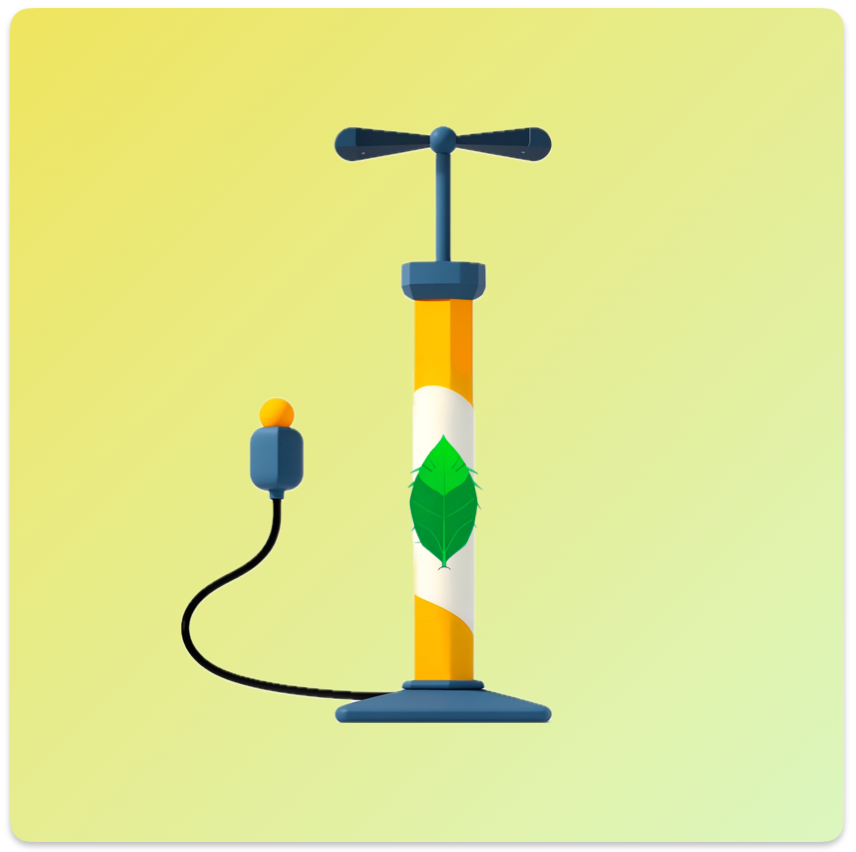
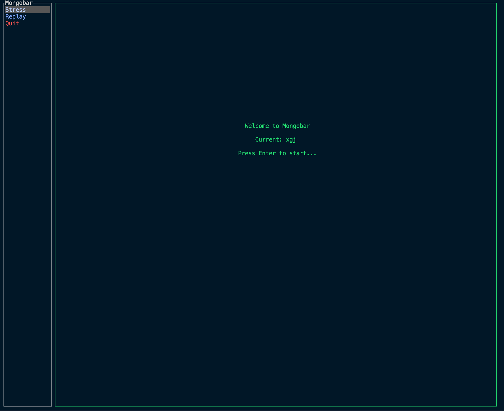

  

  

    
    
  

  

    <a href="https://github.com/nidrs/nidrs/blob/main/readme_zh.md">中文文档</a>
  

# Mongobar

    
    

A mongo stress testing tool written in rust.

## About

@班级小管家/wmc
